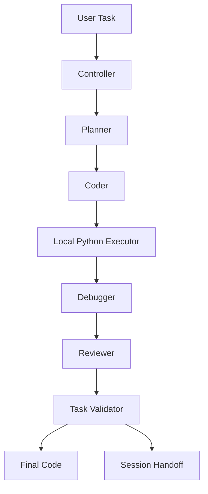

# AI-Assisted Project Building for Systems-Oriented Undergraduates
## A Case Study in Agentic Coding, Failure Analysis, Prompt Design, and Skill Prioritization

**Author:** Ruiyi Wu  
**Affiliation:** Department of Computer Science, University of Illinois Chicago  
**Contact:** ray20171037@gmail.com  
**Keywords:** multi-agent systems, AI-assisted software engineering, prompt engineering, undergraduate education, local coding harness, semantic validation, provider fallback

---

### Abstract

This paper studies how a systems-oriented undergraduate can use large language models to design, implement, debug, document, evaluate, and publicly present a non-trivial software project. The case study is a local multi-agent coding harness built around planner, coder, debugger, reviewer, execution, validation, benchmarking, diagnostics, research-wiki ingestion, and cross-model session handoff. Instead of treating AI as a one-shot code generator, this work examines AI as a collaborator embedded in a longer engineering loop [1][2]. The paper focuses on four questions: which failures repeatedly occur in AI-assisted project work, which prompt patterns reduce those failures while controlling token cost, which validation layers are necessary to turn runnable output into usable output, and which areas of computer science remain most valuable for undergraduates in an AI-rich workflow. The main result is that AI increases leverage, but only for students who can specify constraints, inspect failure modes, validate behavior, and restructure a system when naive generation fails.

### 1. Introduction

A common claim in the current AI era is that students no longer need to know much programming because models can write code. This claim is overstated. In practice, AI improves speed most when the student can already reason about:

- system structure
- constraints
- failure modes
- correctness
- evaluation

This project provides a concrete case study. The target system was a local multi-agent coding harness inspired by real-world coding-agent workflows [1]. The harness was built, stress-tested, repeatedly broken, and repeatedly hardened. The process exposed a wide gap between "AI can generate code" and "AI can reliably help build a durable project."

### 2. Research Questions

This paper is organized around four research questions:

1. What types of failures occur when an undergraduate uses AI to build a medium-complexity software project?
2. Which prompt strategies reduce these failures and conserve tokens?
3. What engineering controls are required to make AI-generated project work dependable?
4. In an AI-rich workflow, what should a computer science undergraduate still prioritize learning?

### 3. Contributions

This work makes five concrete contributions.

1. It documents a reproducible undergraduate workflow for building a local multi-agent coding harness under realistic Windows and quota constraints.
2. It develops a failure taxonomy covering environment faults, prompt overbreadth, semantic quality failure, validation gaps, and cross-model continuation problems.
3. It hardens the project with deterministic validators, provider fallback, doctor diagnostics, offline benchmarks, and session handoff packaging.
4. It extends the system with a tracked research-wiki ingester so that source collection, structured notes, and project writing can share the same local toolchain.
5. It derives a practical curriculum argument: students gain the most from AI when they retain systems, debugging, testing, and specification skills.

### 4. Related Work and Context

This case study sits at the intersection of four trends:

- agentic coding systems that split work across planner, coder, debugger, and reviewer roles [1]
- prompt engineering guidance that emphasizes clear instructions, output constraints, and iterative refinement [2][3]
- personal knowledge-base workflows that transform raw sources into linked notes
- undergraduate project building as a portfolio and research activity rather than only a coursework exercise

Rather than claiming a new foundation model or a novel theoretical agent architecture, this work contributes an engineering-grounded study of how an undergraduate can operationalize those ideas locally. The project is intentionally modest in scope: it is designed to be buildable on a student machine, inspectable, and repeatable.

### 5. Case Study Project

The project under study is a local multi-agent coding system with the following components:

- planner
- coder
- debugger
- reviewer
- local Python executor
- task-specific validation
- benchmark/eval suite
- doctor/self-check diagnostics
- research-wiki ingester
- local Web UI
- cross-model session handoff packaging

The system supports both:

- CLI backends using Claude Code CLI and Codex CLI
- SDK backends using Anthropic and OpenAI APIs

The project was developed iteratively under realistic constraints on Windows, including CLI quirks, path issues, quota limits, and environment variability.

#### Figure 1. System architecture



### 6. Methodology

The methodology was iterative and intervention-driven rather than purely observational.

#### 6.1 Build loop

Each cycle followed a common pattern:

1. define a task with runtime and acceptance constraints
2. generate a compact implementation plan
3. generate runnable code
4. execute locally
5. inspect failures
6. add deterministic checks where repeated failure patterns emerged
7. rerun with narrower prompts or revised controller logic

#### 6.2 Data collected during development

The main evidence sources were:

- generated code artifacts
- stdout and stderr traces
- validator failures
- doctor output
- benchmark output
- update-log entries
- compact session handoff summaries

This is sufficient for an engineering case study because the goal is not statistical significance across many users. The goal is to explain how failure surfaced and which interventions improved reliability.

#### 6.3 Why the research-wiki component mattered

The research-wiki workflow turned out to be methodologically important rather than cosmetic. Initially, a standalone generated script was enough to prove that raw source files could be converted into linked notes. However, that script lived outside the main package and therefore sat outside the project's normal testing and review path. Moving the ingester into tracked project code had three benefits:

- its heuristics became inspectable and versioned
- its failure patterns became testable
- the same toolchain used to build the project could also be used to build the paper's source base

This closed the loop between implementation, documentation, and research workflow.

### 7. Evaluation Setup

Evaluation in this project was layered rather than relying on a single metric.

#### 7.1 Runtime success

The first level was simple executability:

- does generated code run
- does it terminate
- does it produce expected files

This level was necessary but not sufficient.

#### 7.2 Semantic validation

The second level examined whether the output was actually useful. For knowledge-base tasks this included:

- preserving the first H1 as the note title
- avoiding malformed `[[links]]`
- rejecting low-value concept labels such as `Notes`, `Source`, or `Core Idea`
- producing an index that links to generated notes
- separating short title aliases from related concepts in generated notes

This layer mattered because a generated tool could run successfully while still creating poor notes.

#### 7.3 Environment readiness

The third level used `doctor` and `doctor-live` checks to separate project defects from:

- authentication problems
- provider quota limits
- path resolution issues
- scratch-directory permission failures

#### 7.4 Repeatable regression checks

The fourth level used local unit tests and offline benchmarks so the project could still be evaluated when external providers were unavailable.

### 8. Failure Taxonomy

The project exposed several recurring failure classes.

#### Table 1. Failure taxonomy

| Failure class | Typical symptom | Main fix | Result |
| --- | --- | --- | --- |
| Semantic quality failure | Code runs but output is unusable | Deterministic validators | Fewer false positives |
| Environment misclassification | Quota, login, or path issue looks like code bug | `doctor` and `doctor-live` | Faster diagnosis |
| Prompt overbreadth | Large plans, slow coding, timeouts | Planner compression and `--fast` | Lower token cost and fewer stalls |
| Relative-path ambiguity | Generated tools behave differently by cwd | Deterministic execution directory | More repeatable evaluation |
| Cross-model interruption | Quota or token exhaustion breaks momentum | Session handoff packaging | Easier continuation |
| Knowledge-base concept noise | Generic labels become formal concepts | Conservative phrase extraction and alias split | Better wiki note quality |

#### 8.1 Runnable but semantically wrong output

This was the most important failure pattern. The generated code might:

- execute successfully
- produce files
- still violate the user's real intent

For example, the knowledge-base ingester could use the wrong note title, extract noisy concepts, or generate malformed wiki links while still exiting successfully.

#### 8.2 Environment failures misread as coding failures

Many failures came from:

- model deprecations
- CLI login state
- shell permissions
- provider quotas
- output decoding differences

These failures initially looked like "the project is broken" when the real problem was environmental.

#### 8.3 Prompt overbreadth

Broad prompts such as "build the whole project" often caused:

- long plan output
- slower coding passes
- timeout risk
- heuristic overreach

Overly broad prompts increased both token cost and instability.

#### 8.4 Relative-path ambiguity

Generated scripts frequently assumed their own working directory. When the harness executed them from a different directory, behavior diverged from the intended tool design.

#### 8.5 Weak success criteria

A controller that treats `returncode == 0` as success is not strong enough for project-shaped tasks. That rule ignores many product-level errors.

#### 8.6 Knowledge-base quality noise

The wiki ingester surfaced a more specific problem: naive concept extraction promoted generic tokens such as `Prompt`, `Docs`, `Source`, and `Success` into formal note concepts. This was not a crash bug. It was a research-quality bug. The fix required moving from broad token frequency heuristics toward more conservative phrase extraction and stronger filtering of low-signal labels.

### 9. What Reduced Failure

Several concrete design choices improved reliability.

#### 9.1 Narrower prompts with hard constraints

Better prompts:

- specified the runtime environment
- stated the acceptance rule
- prohibited known bad outputs
- asked for code only

Example pattern:

```text
Write a minimal local Python tool for [task].
Use only standard-library code unless absolutely necessary.
Preserve [specific invariant].
Do not emit [specific bad outputs].
Return only runnable Python code.
```

This reduced token waste by removing open-ended exploratory prose and focusing the model on implementation constraints [2][3].

#### 9.2 Planner compression

The planner was useful, but passing its entire output into the coder created bloat. Compacting plans before coding improved both speed and stability.

#### 9.3 Task-specific validation

The largest quality gain came from validation. Instead of asking the reviewer model to "notice" all errors, the system introduced explicit checks for:

- title fidelity
- malformed links
- low-value concept labels
- expected index structure

This turned vague dissatisfaction into deterministic rejection rules.

#### 9.4 Environment diagnostics

The addition of `doctor` and `doctor-live` split environment readiness from generation quality. This prevented wasted debugging effort and made provider problems legible.

#### 9.5 Benchmarks

Offline benchmark fixtures enabled repeatable evaluation even when model quotas were unavailable. This is especially important for student projects, where external service availability is not guaranteed.

#### 9.6 Cross-model handoff packaging

Another practical improvement was automatic session packaging. Each run now saves:

- a machine-readable session state
- the latest generated code artifact
- a compact handoff summary with the next recommended prompt

This matters because undergraduate users often work under quota or token limits. A compact handoff package makes it possible to continue the same task with another model without replaying the entire conversation history.

#### 9.7 Versioned wiki-ingester heuristics

Folding the research-wiki ingester into the tracked package improved reliability in a more subtle way. Once concept extraction lived in normal source files with tests, it stopped being a one-off artifact and became part of the project's engineering surface. This made it easier to:

- regress-test noisy concept cases
- refine concept filters incrementally
- tie note quality directly to project quality

### 10. Prompting Principles for Lower Token Cost

Token efficiency improved when prompts obeyed five principles.

#### 10.1 Specify the implementation boundary

Bad:

```text
Build a full-featured app for ...
```

Better:

```text
Build the smallest runnable local implementation for ...
Prefer one Python file unless multiple files are strictly necessary.
```

#### 10.2 State what must not happen

Failure prevention prompts were often more effective than feature prompts. For example:

```text
Do not use API keys.
Do not emit malformed wiki links.
Do not replace the first H1 with a subsection heading.
```

#### 10.3 Request deterministic logic over cleverness

When parsing text, asking for "conservative, predictable logic" helped suppress brittle heuristic behavior.

#### 10.4 Ask for runnable code only

This reduced extra markdown, commentary, and formatting noise that complicates automated execution.

#### 10.5 Reuse local validation language

The most efficient repair prompts reused the exact words of validator failures. This reduced re-explanation and helped the debugger target the real issue.

### 11. What CS Students Still Need to Learn

AI changes the workflow, but it does not erase the value of core CS knowledge. This project suggests that undergraduates should prioritize the following areas.

#### 11.1 Systems thinking

Students still need to understand:

- processes
- filesystems
- working directories
- permissions
- environment variables
- I/O boundaries

Many project failures were systems failures, not language failures.

#### 11.2 Data structures and algorithms

Even with AI assistance, students must recognize whether generated solutions are structurally sensible and scalable.

#### 11.3 Software engineering discipline

Students should still learn:

- decomposition
- testing
- version control
- debugging
- documentation
- interface design

The highest-value work in the case study came from orchestration and validation, not from typing syntax.

#### 11.4 Numerical and probabilistic thinking

As AI systems become more stochastic, students benefit from understanding uncertainty, convergence, tradeoffs, and evaluation metrics.

#### 11.5 Prompt design as specification writing

Prompting should be taught less as "chat skill" and more as:

- requirement writing
- interface specification
- failure-boundary definition

This is closer to software engineering than to casual prompting.

### 12. Proposed Undergraduate AI Workflow

Based on this case study, a productive AI-assisted workflow for undergraduates looks like this:

1. Define the narrowest usable task.
2. State runtime and dependency constraints.
3. Generate a small plan.
4. Compress the plan before coding.
5. Generate code with hard failure constraints.
6. Execute locally.
7. Validate behavior with deterministic checks.
8. Use validator output as repair input.
9. Save a compact handoff summary for cross-model continuation.
10. Document the engineering process.
11. Convert the process into portfolio artifacts.

This workflow is substantially more effective than simply asking a model to "build the whole thing" [2][3].

### 13. Discussion

For students:

- AI is strongest when paired with systems judgment.

For educators:

- teaching should shift from syntax-only emphasis toward validation, decomposition, and evaluation.

For project building:

- the ability to design acceptance criteria may be more valuable than the ability to manually write every line of code.

For undergraduate research:

- project logs, validator outputs, and prompt revisions can themselves become analyzable research material when the build process is sufficiently structured.

### 14. Limitations

This case study has several limitations.

- It is centered on one developer workflow rather than a cohort study.
- It depends partly on proprietary model behavior and quota availability.
- Some improvements are heuristic rather than formally optimal.
- The research-wiki component currently targets markdown-like source material and does not yet cover PDFs or large multi-document synthesis robustly.

These limitations do not invalidate the results, but they do bound the claims.

### 15. Future Work

The next project directions are clear:

- extend the wiki ingester to broader source formats and stronger concept merging
- add richer artifact scoring to the benchmark suite
- compare different model pairings under the same validation regime
- study whether undergraduates with different backgrounds converge on similar prompt and validation patterns
- turn the current paper draft, update log, and research wiki into a more formal public release

### 16. Conclusion

The case study suggests a simple conclusion:

> AI raises the ceiling for undergraduates, but only if they can act as rigorous orchestrators rather than passive prompt users.

The students who benefit most from AI-assisted engineering will likely be those who can:

- specify constraints clearly
- reduce ambiguity
- detect semantic failure
- design validation loops
- understand systems behavior
- convert project work into public, reproducible artifacts

In that sense, AI does not eliminate the need for computer science fundamentals. It makes their practical value more obvious.

### References

[1] Internal project documentation, *Toward a Practical Multi-Agent Coding Harness on Windows*, `docs/AGENT_SYSTEM_PAPER.md`.

[2] OpenAI, *Prompt Engineering Guide*, source summary in `research_wiki/raw/openai_prompt_engineering.md`.

[3] Anthropic, *Prompt Engineering Overview*, source summary in `research_wiki/raw/anthropic_prompt_engineering.md`.

[4] Anthropic, *Claude Code Model Configuration*, source summary in `research_wiki/raw/claude_code_model_config.md`.

[5] Journal of Open Source Software, *Submission Requirements*, source summary in `research_wiki/raw/joss_submission.md`.

[6] University of Illinois Chicago, *Undergraduate Research Forum*, source summary in `research_wiki/raw/uic_undergraduate_research_forum.md`.
