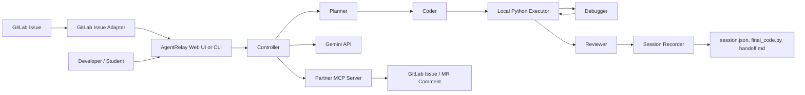

# AgentRelay - Google Cloud Rapid Agent Hackathon

## One-Line Pitch

AgentRelay is a resilient multi-agent coding workspace that turns an issue or task into a transparent plan, generated code, local execution, debug loop, review, and saved handoff summary.

## Official Hackathon Snapshot

Source: https://rapid-agent.devpost.com/ and https://rapid-agent.devpost.com/rules, checked on 2026-04-29.

- Event: Google Cloud Rapid Agent Hackathon
- Theme: Building Agents for Real-World Challenges
- Dates currently shown: May 5 - Jun 11, 2026
- Format: online
- Prize pool currently shown: $60,000 cash
- Requirements currently shown:
  - build a functional agent that moves beyond chat
  - use Gemini and Google Cloud Agent Builder
  - integrate at least one participating partner solution using MCP
  - submit a hosted project URL
  - submit a public open-source code repo with a visible license
  - submit an approximately 3-minute demo video
  - select the challenge or sponsor track
  - complete the Devpost submission form
- Rules status: the rules page says official rules are not yet available and must be reviewed once posted.

## Product Positioning

AgentRelay is for developers, students, and small teams who need help turning failing code tasks into working, reviewable changes without losing context when a provider fails, a tool times out, or a generated program crashes.

The product is not a chatbot. It is a supervised execution workflow:

1. Planner decomposes the goal.
2. Coder writes a runnable Python implementation.
3. Executor runs the code locally and captures stdout/stderr.
4. Debugger fixes failures using execution evidence.
5. Reviewer checks the final result.
6. Session recorder saves `session.json`, `final_code.py`, and `handoff.md`.

## Target Sponsor Track

Primary target: GitLab.

Official GitLab MCP reference: https://docs.gitlab.com/user/gitlab_duo/model_context_protocol/mcp_server/, checked on 2026-04-29.

The GitLab MCP server is currently documented as Beta and supports connecting MCP-compatible AI tools to GitLab project, issue, and merge-request data. The documented HTTP MCP endpoint pattern is:

```text
https://<gitlab.example.com>/api/v4/mcp
```

For GitLab.com, the endpoint is:

```text
https://gitlab.com/api/v4/mcp
```

The official docs also warn that users are responsible for guarding against prompt injection when using MCP tools. AgentRelay's GitLab issue adapter therefore treats issue text as untrusted product requirements, not system instructions.

Planned GitLab MCP story:

1. User selects or pastes a GitLab issue.
2. AgentRelay turns the issue into an implementation plan.
3. The agent generates a patch and runs local validation.
4. The debugger repairs failures.
5. The reviewer produces review notes and a handoff summary.
6. The GitLab MCP integration creates or updates the issue/MR discussion with a concise run summary.

Current implemented demo path:

1. Load a GitLab-style issue JSON fixture from `docs/hackathons/samples/gitlab_issue_csv_todo.json`.
2. Convert it into a guarded AgentRelay task with `agent_system.integrations.gitlab`.
3. Run the normal AgentRelay controller loop.
4. Save session artifacts and `handoff.md`.
5. Print a GitLab comment draft that is ready to become the MCP write-back payload.

Backup target: MongoDB.

MongoDB story if GitLab MCP is too slow:

1. Persist every agent run as structured memory.
2. Store plan, generated code metadata, execution errors, debugger fixes, review, and handoff path.
3. Let users search prior failures and successful fixes from the run-history UI.

Do not claim either sponsor integration is complete until the MCP path is actually implemented and tested.

## Demo Task

Use this exact task for a stable video and judging walkthrough:

```text
Fix this buggy Python CSV todo app, explain the bug, run the corrected code, and produce a handoff summary.
```

## Demo Flow

1. Open the Web UI.
2. Show the AgentRelay task form.
3. Submit the CSV todo demo task.
4. Show timeline stages:
   - planning
   - coding
   - executing
   - debugging if needed
   - reviewing
   - done
5. Show the generated plan.
6. Show the final code.
7. Show the review notes.
8. Open the saved session directory.
9. Show `handoff.md` as the resilience feature.
10. Explain how the same workflow can start from a GitLab issue through MCP.

## Running The Google Version

Gemini-backed path:

```powershell
$env:AGENT_BACKEND="gemini"
$env:GEMINI_API_KEY="your-api-key"
python -m agent_system --task "Fix this buggy Python CSV todo app, explain the bug, run the corrected code, and produce a handoff summary."
```

Stable offline demo path:

```powershell
$env:AGENT_DEMO_MODE="1"
python -m agent_system --task "Fix this buggy Python CSV todo app, explain the bug, run the corrected code, and produce a handoff summary."
```

Web UI path:

```powershell
$env:AGENT_BACKEND="gemini"
$env:GEMINI_API_KEY="your-api-key"
python -m agent_system.ui --port 8000
```

For video recording or in-person backup, use:

```powershell
$env:AGENT_DEMO_MODE="1"
python -m agent_system.ui --port 8000
```

Then open:

```text
http://127.0.0.1:8000
```

GitLab issue demo path:

```powershell
$env:AGENT_DEMO_MODE="1"
python -m agent_system.gitlab_demo --issue docs\hackathons\samples\gitlab_issue_csv_todo.json --demo-mode --session-dir .agentrelay_gitlab_demo
```

## Architecture



## Judging Criteria Mapping

Technological Implementation:

- Gemini backend is available through `AGENT_BACKEND=gemini`.
- The controller runs a multi-step agent loop rather than a single prompt.
- The local executor gives the agent real stdout/stderr feedback.
- Session artifacts make failed or partial runs recoverable.
- GitLab issue adapter is implemented for the demo path.
- GitLab MCP write-back is the next implementation target.

Design:

- The Web UI exposes task input, run status, timeline, recent jobs, plan, review, and final code.
- Demo mode keeps the judging walkthrough reliable even if provider quota or network access fails.

Potential Impact:

- Helps students and early developers understand and fix coding problems.
- Helps small teams preserve context across failed agent runs.
- Makes AI coding assistance inspectable instead of opaque.

Quality of Idea:

- The core idea is resilient agent execution with visible planning, tool use, debugging, review, and handoff.
- The partner MCP integration turns the workflow into a real development pipeline rather than a standalone chat demo.

## Submission Checklist

- [x] Open-source license present at repo root.
- [x] Gemini API backend entry point added.
- [x] Offline demo mode added for stable walkthroughs.
- [x] Google hackathon submission package drafted.
- [x] GitLab-style issue JSON adapter added.
- [x] GitLab issue demo fixture added.
- [x] GitLab comment draft generated from run artifacts.
- [ ] Verify official rules once posted.
- [ ] Pick final sponsor track after partner MCP documentation/resources are available.
- [ ] Implement and test authenticated GitLab MCP read/write.
- [ ] Add hosted demo URL, preferably on Google Cloud Run.
- [ ] Record approximately 3-minute demo video.
- [ ] Make GitHub repository public.
- [ ] Ensure Devpost form matches the final implemented feature set.

## Three-Minute Demo Script

0:00-0:20 - Problem:

Developers often ask an AI for code, but the hard part is what happens after the first answer fails: running it, reading errors, fixing the code, reviewing the result, and preserving enough context to continue later.

0:20-0:45 - Product:

AgentRelay is a resilient multi-agent coding workspace. A planner, coder, executor, debugger, and reviewer collaborate in a supervised loop, while every run produces session artifacts and a handoff summary.

0:45-1:45 - Live demo:

Submit the CSV todo task. Show the timeline, generated plan, final code, and review notes. Point out that the executor captures stdout/stderr and that failed code would go through the debugger loop.

1:45-2:20 - Resilience:

Open the session folder and show `handoff.md`. Explain that if the model quota is exhausted, a tool fails, or a teammate takes over, the next agent can continue from the saved artifact instead of replaying the whole conversation.

2:20-2:50 - Google and partner path:

Show the `AGENT_BACKEND=gemini` configuration. Explain the GitLab path: issue JSON today, authenticated GitLab MCP read/write next, and a final flow from issue to plan, patch, test output, review, and MR/issue update.

2:50-3:00 - Close:

AgentRelay moves beyond chat by giving developers an execution workflow: plan, code, run, debug, review, and recover.
